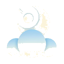
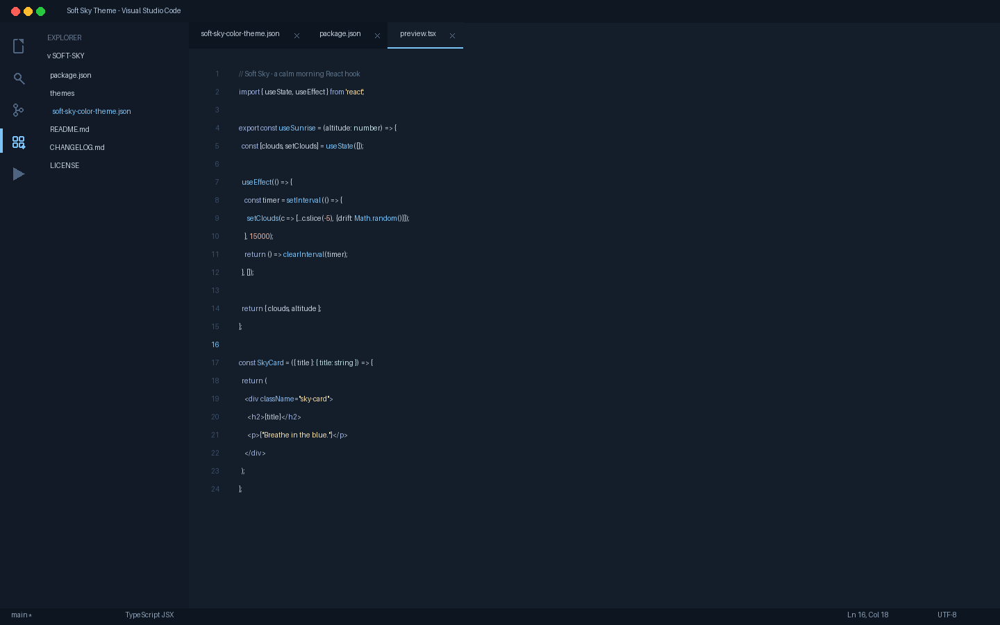
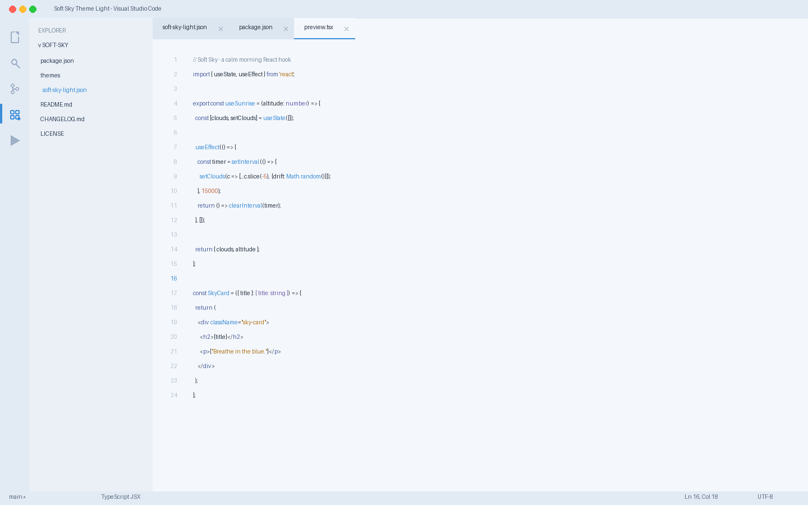

# Soft Sky Theme

[](https://marketplace.visualstudio.com/items?itemName=lilinhuang.soft-sky-theme)

A premium pastel blue VS Code theme inspired by a soft morning sky, gentle clouds, and calm ocean horizons — available in **Dark** and **Light** — designed for relaxed, focused, all-day coding.

> *A quiet blue sky at dawn, where code flows like morning light.*



## Features

- **Two themes in one:** Soft Sky Dark + Soft Sky Light
- Calm pastel blue palette with soft blue-gray layers and warm cream accents
- No pure black, no pure white — comfortable contrast for long sessions
- Eye-friendly and relaxing for deep-focus development
- Full syntax highlighting for JavaScript, TypeScript, React, JSX, HTML, CSS, JSON, Python, Markdown
- Complete UI theming: editor, activity bar, sidebar, tabs, terminal, git, notifications
- Semantic token highlighting support
- Modern, minimal, premium aesthetic

## Screenshots

### Soft Sky Dark

Soft sky blue background for calm morning coding.



```
editor.background:   #141D2A
sidebar:             #111A26
accent:              #7CC4F8
cursor:              #FFE3B0
```

### Soft Sky Light

Soft dawn-blue white background for bright, airy daytime coding.



```
editor.background:   #F4F7FB
sidebar:             #EAF0F6
accent:              #3A8DD8
cursor:              #E8A642
```

## Color Palette

### Dark

| Role | Color | Hex |
|------|-------|-----|
| Background | 🌌 deep sky | `#141D2A` |
| Sidebar / Activity Bar | 🌒 dusk layer | `#111A26` |
| Primary Accent | ☁️ sky blue | `#7CC4F8` |
| Keywords | 🔷 lavender blue | `#9FB3DF` |
| Functions | 🔵 bright sky | `#7CC4F8` |
| Strings | 🧈 warm cream | `#F5DFA8` |
| Numbers | 🍑 pastel peach | `#F0B7A4` |
| Comments | 🌫️ soft gray-blue | `#5E7388` |
| Cursor | 🌅 warm sunrise | `#FFE3B0` |

### Light

| Role | Color | Hex |
|------|-------|-----|
| Background | 🌤️ dawn white | `#F4F7FB` |
| Sidebar / Activity Bar | 🌥️ pale cloud layer | `#EAF0F6` |
| Primary Accent | 🔵 clear sky blue | `#3A8DD8` |
| Keywords | 🔷 soft indigo | `#4A5FA0` |
| Functions | 🔵 sky blue | `#3A8DD8` |
| Strings | 🧡 warm amber | `#B0761F` |
| Numbers | 🍑 soft coral | `#C4653F` |
| Comments | 🌫️ muted blue-gray | `#7A8CA0` |
| Cursor | 🌅 golden sunrise | `#E8A642` |

## Installation

1. Open the Extensions view in VS Code (`Ctrl+Shift+X`)
2. Search for **"Soft Sky"**
3. Click **Install**
4. Open Command Palette (`Ctrl+Shift+P`) → **Preferences: Color Theme** → select **Soft Sky Dark** or **Soft Sky Light**

Or install from the [Visual Studio Marketplace](https://marketplace.visualstudio.com/items?itemName=lilinhuang.soft-sky-theme).

## Customization

Soft Sky Theme is fully customizable via VS Code settings:

```jsonc
{
  // Override any color in your settings.json
  "workbench.colorCustomizations": {
    "editor.background": "#141D2A",   // dark
    "activityBar.background": "#0E1621"
  }
}
```

```jsonc
{
  // Light theme overrides
  "workbench.colorCustomizations": {
    "[Soft Sky Light]": {
      "editor.background": "#F4F7FB",
      "activityBar.background": "#E2EAF4"
    }
  }
}
```

## Supported Languages

Optimized syntax highlighting for:
- JavaScript / TypeScript
- React / JSX / TSX
- HTML / CSS / SCSS
- JSON / YAML
- Python
- Markdown
- And more...

## Part of a Theme Collection

Soft Sky Theme belongs to a cohesive personal VS Code theme collection:

- [Pastel Pink](https://marketplace.visualstudio.com/items?itemName=lilinhuang.pastel-pink)
- [Olive Dream](https://marketplace.visualstudio.com/items?itemName=lilinhuang.olive-dream)
- [Cozy Latte](https://marketplace.visualstudio.com/items?itemName=lilinhuang.cozy-latte)
- [Lavender Mist](https://marketplace.visualstudio.com/items?itemName=lilinhuang.lavender-mist)
- **Soft Sky**

## Credits

Designed by [Li Lin Huang](https://www.linkedin.com/in/%E4%B8%BD%E9%9C%96-%E9%BB%84-7b7794373/) — inspired by quiet blue skies in the morning, drifting clouds, and the calm flow of building software.

## License

[Non-Commercial License](LICENSE) — Free for personal, educational, and non-commercial use.
